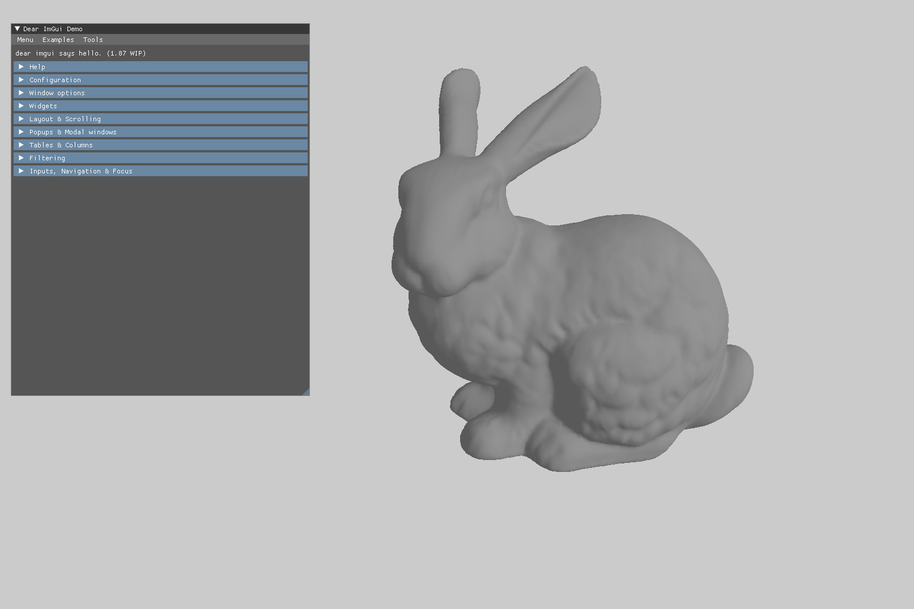

# RainEngine



A minimum Vulkan renderer example inspired by [Vulkan Tutorial](https://vulkan-tutorial.com/) and [GamePhysicsWeekend](https://github.com/gamephysicsweekend/VulkanRenderer).

## Requirements

* [xmake](https://xmake.io/#/): a cross-platform build utility based on Lua, more elegent than CMake. It directly handles the following dependencies:
  * glfw
  * spdlog
  * eigen
  * tinyobjloader
* [Vulkan SDK](https://vulkan.lunarg.com/sdk/home): now Vulkan is imported by calling CMake in xmake, if the environment variable is correctly set xmake should easily find it. One can try other ways to import this library by modifying `xmake.lua`.

## To Build

```
xmake
./compile_shader.sh
```

## To Run

```
cd bin
./RainEngine
```